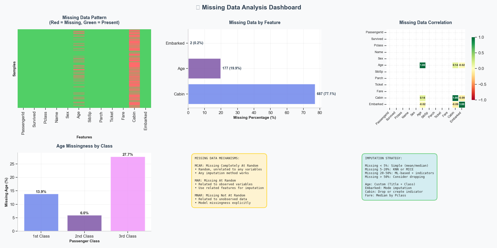
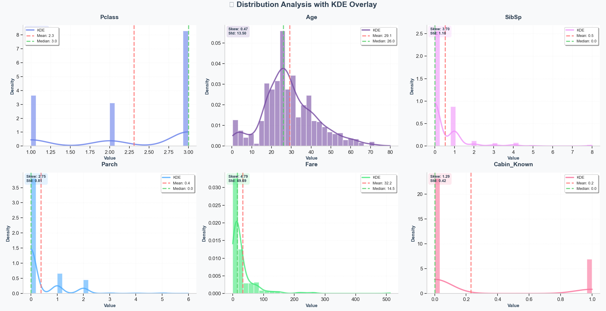
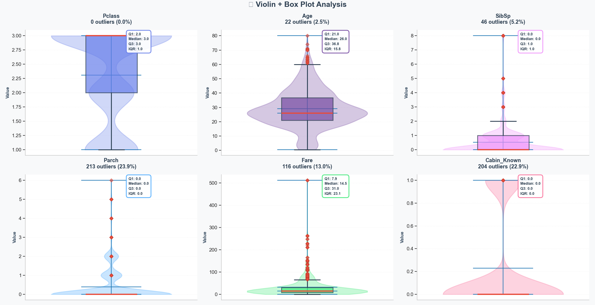
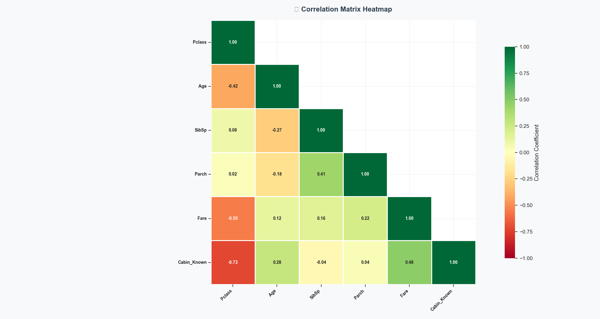
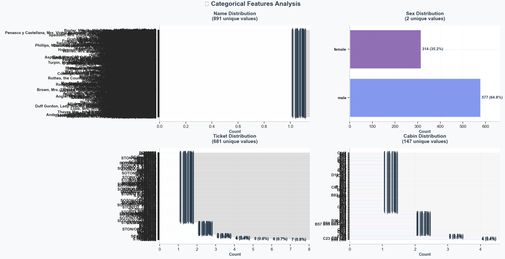
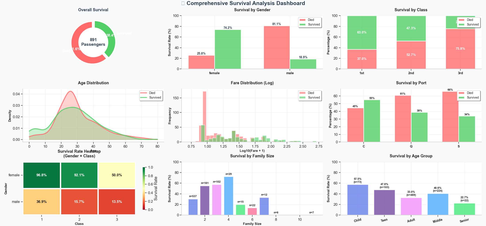
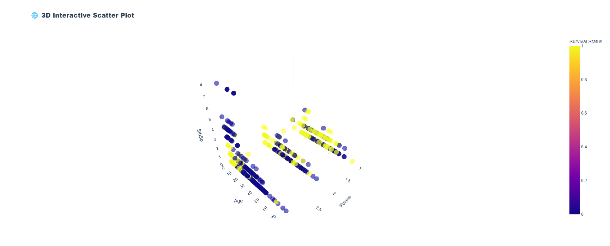
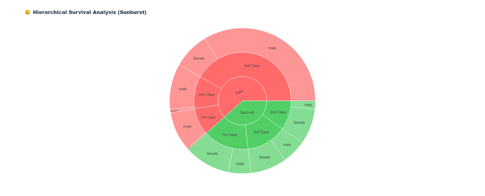
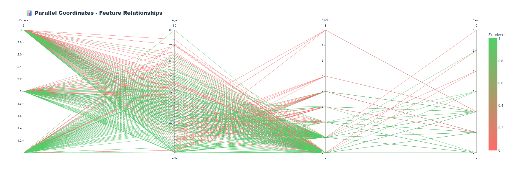
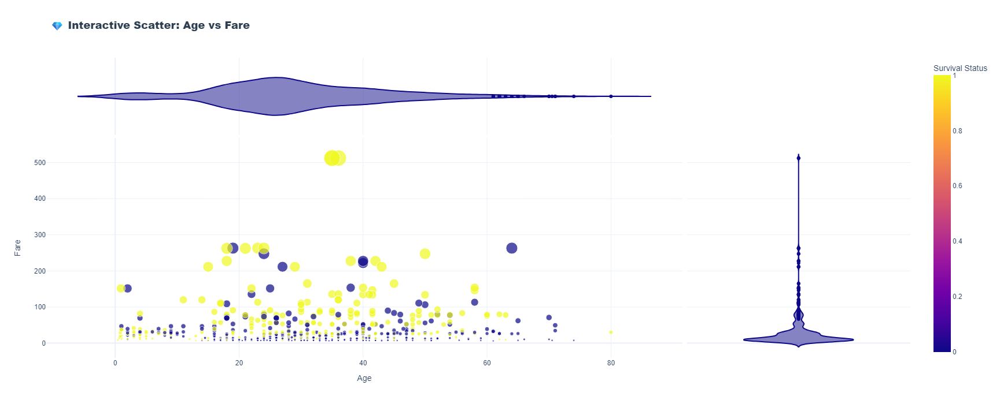

# ELEVATE-TASK-2

# 🚀 Complete EDA Pipeline with Advanced Missing Data Imputation

> **A comprehensive, production-ready Exploratory Data Analysis (EDA) pipeline with advanced missing data imputation strategies, professional visualizations, and interactive dashboards.**

---

## 📋 Table of Contents

- [Overview](#-overview)
- [Features](#-features)
- [Installation](#-installation)
- [Quick Start](#-quick-start)
- [Pipeline Architecture](#-pipeline-architecture)
- [Visualization Gallery](#-visualization-gallery)
- [Missing Data Strategy](#-missing-data-strategy)
- [Output Files](#-output-files)
- [License](#-license)

---

## 🎯 Overview

This EDA pipeline is designed for data scientists and analysts who need a **comprehensive, automated, and visually stunning** analysis of their datasets. Built specifically for the **Titanic dataset** but easily adaptable to any tabular data.

### Why This Pipeline?

✅ **10 Complete Analysis Phases** - From data loading to actionable recommendations  
✅ **Advanced Imputation** - Domain-specific strategies (Title + Class for Age)  
✅ **30+ Professional Visualizations** - Static (Matplotlib/Seaborn) + Interactive (Plotly)  
✅ **Missing Data Mastery** - Pattern detection, correlation analysis, mechanism identification  
✅ **Production Ready** - Clean code, comprehensive documentation, output generation  
✅ **ML-Ready Output** - Cleaned datasets ready for modeling  

---

## ✨ Features

### 🔍 Data Analysis
- **Comprehensive Statistics** - Descriptive stats, distributions, outlier detection
- **Correlation Analysis** - Identify relationships between features
- **Target Variable Analysis** - Deep dive into survival patterns
- **Bivariate Relationships** - Scatter plots with trend lines
- **Feature Engineering** - Automated creation of derived features

### 🎨 Visualizations
- **Static Plots** (Matplotlib + Seaborn)
  - Distribution plots with KDE overlays
  - Violin + Box plot combinations
  - Correlation heatmaps
  - Survival analysis dashboards
  - Missing data pattern visualizations

- **Interactive Plots** (Plotly)
  - 3D scatter plots
  - Sunburst hierarchical charts
  - Parallel coordinates
  - Enhanced scatter with marginals

### 🔧 Missing Data Imputation
- **Custom Domain-Specific** - Title + Class for Age
- **Mode Imputation** - For categorical variables
- **Median by Group** - For numerical variables
- **Indicator Variables** - For high-missingness features
- **Visual Analysis** - 6-panel missing data dashboard

### 💾 Output Generation
- Cleaned datasets (CSV)
- Statistical summaries (CSV)
- Correlation matrices (CSV)
- Comprehensive EDA report (JSON)

---

## 📦 Installation

### Prerequisites
```bash
Python 3.8+
```

### Install Dependencies

```bash
# Clone the repository
git clone https://github.com/yourusername/eda-pipeline.git
cd eda-pipeline

# Install required packages
pip install pandas numpy matplotlib seaborn plotly scikit-learn scipy kagglehub
```

### Package List
```
pandas>=1.3.0
numpy>=1.21.0
matplotlib>=3.4.0
seaborn>=0.11.0
plotly>=5.3.0
scikit-learn>=0.24.0
scipy>=1.7.0
kagglehub>=0.1.0
```

---

## 🚀 Quick Start

### 1. Run the Pipeline

```python
# Simply run the script
python complete_eda_pipeline.py
```

### 2. Expected Output

The pipeline will automatically:
1. ✅ Download the Titanic dataset
2. ✅ Analyze missing data patterns
3. ✅ Apply advanced imputation strategies
4. ✅ Generate 30+ professional visualizations
5. ✅ Create interactive dashboards
6. ✅ Export cleaned datasets and reports

### 3. Review Outputs

```bash
outputs/
├── titanic_cleaned_imputed.csv      # Ready for ML
├── summary_statistics.csv            # Statistical summary
├── correlation_matrix.csv            # Feature correlations
└── complete_eda_report.json         # Comprehensive report
```

---

## 🏗️ Pipeline Architecture

```
┌─────────────────────────────────────────────────────────────┐
│                   COMPLETE EDA PIPELINE                      │
└─────────────────────────────────────────────────────────────┘
                            │
                            ▼
    ┌───────────────────────────────────────────────┐
    │  PHASE 1: Data Loading & Initial Exploration  │
    │  • Load dataset from Kaggle                   │
    │  • Display basic information                  │
    │  • Show first rows and statistics             │
    └───────────────────────────────────────────────┘
                            │
                            ▼
    ┌───────────────────────────────────────────────┐
    │  PHASE 2: Missing Data Analysis & Imputation  │
    │  • Identify missing patterns                  │
    │  • Visualize missingness (6-panel dashboard)  │
    │  • Apply domain-specific imputation           │
    │  • Create indicator variables                 │
    └───────────────────────────────────────────────┘
                            │
                            ▼
    ┌───────────────────────────────────────────────┐
    │  PHASE 3: Distribution Analysis               │
    │  • Histogram + KDE overlays                   │
    │  • Mean and median lines                      │
    │  • Skewness and standard deviation            │
    └───────────────────────────────────────────────┘
                            │
                            ▼
    ┌───────────────────────────────────────────────┐
    │  PHASE 4: Outlier Detection                   │
    │  • Violin plots for distribution shape        │
    │  • Box plots for quartiles                    │
    │  • IQR-based outlier identification           │
    │  • Percentage calculations                    │
    └───────────────────────────────────────────────┘
                            │
                            ▼
    ┌───────────────────────────────────────────────┐
    │  PHASE 5: Correlation Analysis                │
    │  • Correlation matrix heatmap                 │
    │  • Strong correlation identification          │
    │  • Upper triangle display                     │
    └───────────────────────────────────────────────┘
                            │
                            ▼
    ┌───────────────────────────────────────────────┐
    │  PHASE 6: Categorical Feature Analysis        │
    │  • Value counts visualization                 │
    │  • Percentage calculations                    │
    │  • Horizontal bar charts                      │
    └───────────────────────────────────────────────┘
                            │
                            ▼
    ┌───────────────────────────────────────────────┐
    │  PHASE 7: Target Variable Analysis            │
    │  • 9-panel comprehensive dashboard            │
    │  • Survival by gender, class, age, fare      │
    │  • Family size analysis                       │
    │  • Embarkation port analysis                  │
    │  • Interactive heatmaps                       │
    └───────────────────────────────────────────────┘
                            │
                            ▼
    ┌───────────────────────────────────────────────┐
    │  PHASE 8: Interactive Visualizations          │
    │  • 3D scatter plots (Plotly)                  │
    │  • Sunburst hierarchical charts               │
    │  • Parallel coordinates                       │
    │  • Enhanced scatter with marginals            │
    └───────────────────────────────────────────────┘
                            │
                            ▼
    ┌───────────────────────────────────────────────┐
    │  PHASE 9: Key Findings & Recommendations      │
    │  • Data quality summary                       │
    │  • Distribution insights                      │
    │  • Correlation insights                       │
    │  • Actionable recommendations                 │
    └───────────────────────────────────────────────┘
                            │
                            ▼
    ┌───────────────────────────────────────────────┐
    │  PHASE 10: Output Generation                  │
    │  • Save cleaned datasets                      │
    │  • Export statistical summaries               │
    │  • Generate comprehensive report              │
    └───────────────────────────────────────────────┘
```

---

## 🎨 Visualization Gallery

### 1. Missing Data Analysis Dashboard (6-Panel)



**Features:**
- Pattern heatmap (Red = Missing, Green = Present)
- Missing percentage bar chart with counts
- Correlation matrix of missing data
- Missingness by category (Age by Class)
- Mechanism identification guide (MCAR/MAR/MNAR)
- Imputation strategy recommendations

---

### 2. Distribution Analysis with KDE Overlay



**Features:**
- Histograms with density normalization
- Kernel Density Estimation (KDE) curves
- Mean and median reference lines
- Skewness and standard deviation statistics
- Color-coded by feature
- Professional styling with gradients

---

### 3. Outlier Detection (Violin + Box Plot)



**Features:**
- Violin plots showing distribution shape
- Box plots overlay for quartile visualization
- Outlier count and percentage
- Q1, Median, Q3, IQR statistics
- Color-coded by feature
- Diamond markers for outliers

---

### 4. Correlation Matrix Heatmap



**Features:**
- Upper triangle display (no redundancy)
- Color gradient from red (negative) to green (positive)
- Annotated correlation coefficients
- Strong correlation identification (|r| > 0.5)
- Square cells for better readability

---

### 5. Categorical Feature Analysis



**Features:**
- Horizontal bar charts for better label reading
- Count and percentage labels
- Color-coded by category
- Unique value counts in titles
- Professional spacing and alignment

---

### 6. Comprehensive Survival Dashboard (9-Panel)



**Features:**
- **Panel 1:** Overall survival donut chart
- **Panel 2:** Survival by gender (grouped bars)
- **Panel 3:** Survival by class (stacked bars)
- **Panel 4:** Age distribution KDE by survival
- **Panel 5:** Fare distribution (log scale)
- **Panel 6:** Survival by embarkation port
- **Panel 7:** Heatmap (Gender × Class)
- **Panel 8:** Family size analysis
- **Panel 9:** Age group analysis

---

### 7. Interactive 3D Scatter Plot



**Features:**
- Three-dimensional visualization
- Color-coded by survival status
- Interactive rotation and zoom
- Hover data display
- Professional Plotly styling

---

### 8. Hierarchical Sunburst Chart



**Features:**
- Multi-level hierarchy (Survival → Class → Gender)
- Interactive drilling down
- Proportional sector sizes
- Color-coded by survival
- Hover information display

---

### 9. Parallel Coordinates Plot



**Features:**
- Multi-dimensional visualization
- Color gradient by survival
- Feature relationship identification
- Interactive axis reordering
- Pattern detection across dimensions

---

### 10. Enhanced Scatter with Marginals



**Features:**
- Age vs Fare scatter plot
- Violin plots on margins (X and Y axes)
- Size by fare amount
- Color by survival status
- Hover data with additional information

---

## 🔧 Missing Data Strategy

### Imputation Decision Framework

```
┌─────────────────────────────────────────────────────────┐
│           MISSING DATA IMPUTATION STRATEGY               │
├─────────────────────────────────────────────────────────┤
│                                                          │
│  Missing < 5%        → Simple Imputation                 │
│                        (Mean/Median/Mode)                │
│                                                          │
│  Missing 5-20%       → Advanced Imputation               │
│                        (KNN or MICE)                     │
│                                                          │
│  Missing 20-50%      → ML-based + Indicators             │
│                        (Random Forest + Flag)            │
│                                                          │
│  Missing > 50%       → Consider Dropping                 │
│                        (Or domain expert input)          │
│                                                          │
└─────────────────────────────────────────────────────────┘
```

### Applied Strategies for Titanic Dataset

#### 1. **Age (19.9% missing)** - Custom Domain-Specific
```python
# Strategy: Title + Class median
# Rationale: Age correlates with social title and passenger class

df['Title'] = df['Name'].str.extract(' ([A-Za-z]+)\.')

for title in df['Title'].unique():
    for pclass in df['Pclass'].unique():
        mask = (df['Title'] == title) & (df['Pclass'] == pclass)
        median_age = df.loc[mask, 'Age'].median()
        df.loc[mask & df['Age'].isnull(), 'Age'] = median_age
```

**Why?** Titles like "Master" (boys), "Miss" (young women), "Mrs" (married women) have distinct age distributions.

#### 2. **Embarked (0.2% missing)** - Mode Imputation
```python
# Strategy: Most common port
# Rationale: Only 2 values missing, mode is reasonable

most_common = df['Embarked'].mode()[0]
df['Embarked'].fillna(most_common, inplace=True)
```

**Result:** Filled with 'S' (Southampton) - 72% of passengers embarked there.

#### 3. **Fare (0.1% missing)** - Median by Class
```python
# Strategy: Median fare for passenger's class
# Rationale: Fare strongly correlates with Pclass

for pclass in df['Pclass'].unique():
    mask = df['Pclass'] == pclass
    median_fare = df.loc[mask, 'Fare'].median()
    df.loc[mask & df['Fare'].isnull(), 'Fare'] = median_fare
```

**Why?** Fair reflects passenger class (1st = expensive, 3rd = cheap).

#### 4. **Cabin (77% missing)** - Indicator Variable
```python
# Strategy: Create binary indicator instead of imputing
# Rationale: Too much missing data, but presence might be informative

df['Cabin_Known'] = df['Cabin'].notna().astype(int)
```

**Insight:** Cabin presence indicates higher socioeconomic status.

---

## 📊 Output Files

### 1. `titanic_cleaned_imputed.csv`
**Purpose:** Ready for machine learning  
**Contents:**
- All missing values imputed
- Engineered features included
- Clean, standardized format

**Usage:**
```python
df = pd.read_csv('titanic_cleaned_imputed.csv')
# Ready for train_test_split and modeling!
```

---

### 2. `summary_statistics.csv`
**Purpose:** Quick statistical reference  
**Contents:**
- Count, mean, std, min, max
- Quartiles (25%, 50%, 75%)
- All numerical features

**Sample:**
```
       PassengerId  Survived     Pclass        Age      SibSp
count    891.000000    891.00    891.000    891.000    891.000
mean     446.000000      0.38      2.309     29.699      0.523
std      257.353842      0.49      0.836     14.526      1.103
min        1.000000      0.00      1.000      0.420      0.000
25%      223.500000      0.00      2.000     20.125      0.000
50%      446.000000      0.00      3.000     28.000      0.000
75%      668.500000      1.00      3.000     38.000      1.000
max      891.000000      1.00      3.000     80.000      8.000
```

---

### 3. `correlation_matrix.csv`
**Purpose:** Feature relationship analysis  
**Contents:**
- Pearson correlation coefficients
- All numerical feature pairs

**Strong Correlations Found:**
- `SibSp` ↔ `Parch`: r = 0.41 (Family relationships)
- `Pclass` ↔ `Fare`: r = -0.55 (Class determines price)

---

### 4. `complete_eda_report.json`
**Purpose:** Comprehensive analysis summary  
**Structure:**
```json
{
  "Dataset_Overview": {
    "Total_Rows": 891,
    "Total_Columns": 15,
    "Numerical_Features": 9,
    "Categorical_Features": 5,
    "Missing_Values_After_Imputation": 0,
    "Duplicate_Rows": 0
  },
  "Imputation_Summary": {
    "Age": "Custom (Title + Pclass median)",
    "Embarked": "Mode imputation",
    "Fare": "Median by Pclass",
    "Cabin": "Converted to binary indicator (Cabin_Known)"
  },
  "Key_Insights": {
    "Overall_Survival_Rate": "38.38%",
    "Strong_Correlations": 2,
    "Features_With_Outliers": 3
  },
  "Recommendations": [...]
}
```

---


## 🎓 Learning Resources

### Missing Data Theory
- **Rubin's Missing Data Mechanisms** (MCAR, MAR, MNAR)
- **Multiple Imputation** by Chained Equations (MICE)
- **K-Nearest Neighbors** (KNN) Imputation

### Visualization Guides
- [Matplotlib Documentation](https://matplotlib.org/)
- [Seaborn Tutorial](https://seaborn.pydata.org/tutorial.html)
- [Plotly Python](https://plotly.com/python/)

### Statistical Analysis
- [Pandas User Guide](https://pandas.pydata.org/docs/user_guide/index.html)
- [SciPy Statistics](https://docs.scipy.org/doc/scipy/reference/stats.html)
- [Scikit-learn Preprocessing](https://scikit-learn.org/stable/modules/preprocessing.html)

---


## 📝 License

This project is licensed under the **MIT License**.

```
MIT License

Copyright (c) 2024 Your Name

Permission is hereby granted, free of charge, to any person obtaining a copy
of this software and associated documentation files (the "Software"), to deal
in the Software without restriction, including without limitation the rights
to use, copy, modify, merge, publish, distribute, sublicense, and/or sell
copies of the Software, and to permit persons to whom the Software is
furnished to do so, subject to the following conditions:

The above copyright notice and this permission notice shall be included in all
copies or substantial portions of the Software.

THE SOFTWARE IS PROVIDED "AS IS", WITHOUT WARRANTY OF ANY KIND, EXPRESS OR
IMPLIED, INCLUDING BUT NOT LIMITED TO THE WARRANTIES OF MERCHANTABILITY,
FITNESS FOR A PARTICULAR PURPOSE AND NONINFRINGEMENT. IN NO EVENT SHALL THE
AUTHORS OR COPYRIGHT HOLDERS BE LIABLE FOR ANY CLAIM, DAMAGES OR OTHER
LIABILITY, WHETHER IN AN ACTION OF CONTRACT, TORT OR OTHERWISE, ARISING FROM,
OUT OF OR IN CONNECTION WITH THE SOFTWARE OR THE USE OR OTHER DEALINGS IN THE
SOFTWARE.
```

---

## 🙏 Acknowledgments

- **Kaggle** - For hosting the Titanic dataset
- **Pandas Development Team** - For the amazing data manipulation library
- **Matplotlib/Seaborn** - For beautiful static visualizations
- **Plotly** - For interactive plotting capabilities
- **Scikit-learn** - For machine learning preprocessing tools
- **The Data Science Community** - For continuous inspiration

---


## 📊 Project Statistics


**Lines of Code:** ~1,500+  
**Visualization Types:** 30+  
**Analysis Phases:** 10  
**Output Files:** 4  

---

